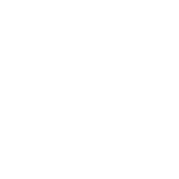

# DAO（道）

> “道生一，一生二，二生三，三生万物” ——《道德经》

- **项目地址**：https://dao.xiexuefeng.cc/

这是一个专注于**生成艺术**和**人机交互**相关的 Web 作品项目，即通过网页这一载体来呈现我个人关于视觉和交互方面的想法。

之所以要决定做这个项目，是受到 [Antfu](https://github.com/antfu) 的 [100 days](https://100.antfu.me/) 项目所启发的。因为从接触前端这个领域开始我自己就断断续续做了一些 Web 作品，有的是发布在 [XueFeng on CodePen](https://codepen.io/xxf1996/) 上，而有的则是在各个 GitHub 项目中，因此特别**分散**。当我看到 100days 类似的项目时，我觉得是时候把这类作品**集中**进行管理了，除去之前已经写出来的作品，毕竟还有很多躺在 idea 清单里的作品雏形呢。
